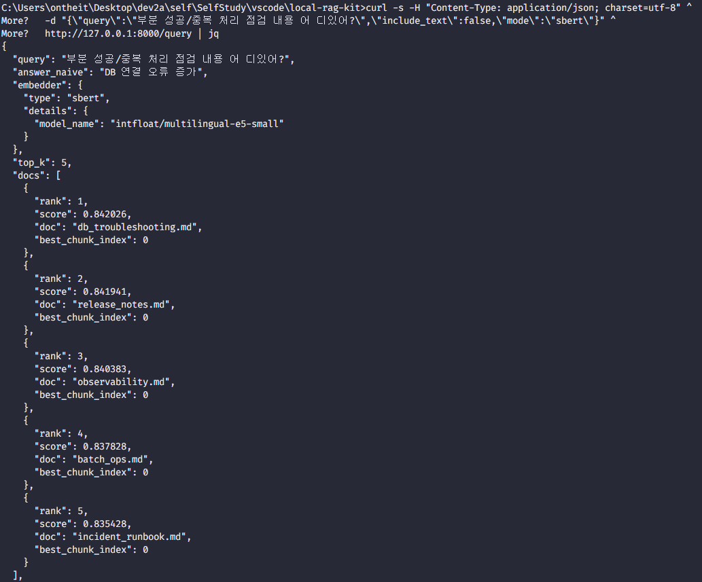
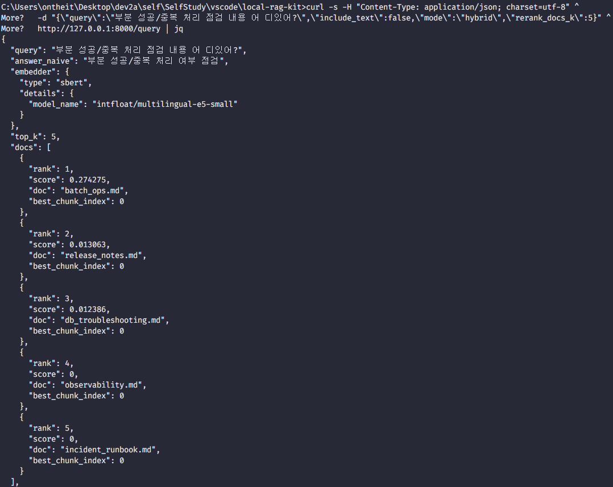

# Local RAG Kit (v0.1)

로컬 문서 검색 키트: **Index + Query API + Eval(Recall@K) + Hybrid rerank**  
TF-IDF / SBERT 검색을 비교하고, **SBERT 후보 문서 → TF-IDF 재정렬**로 "1등 정확도(Recall@1)"를 끌어올립니다.

## Demo


## Screenshots
| Query (SBERT) | Query(Hybrid) |
| --- | --- |
|  |  |

## Features
- **로컬 문서 인덱싱**
  - `.md`, `.txt` 문서 로드
  - Chunking(size/overlap)
  - 인덱스 생성: **TF-IDF / SBERT**
- **Query API (FastAPI)**
  - `mode=tfidf | sbert | hybrid`
  - top docs / top chunks 근거 반환
  - `include_text=false`로 응답 경량화
  - `score_type` 제공
    - `sbert_cosine`
    - `tfidf_cosine`
    - `tfidf_cosine_rerank` (hybrid)
- **Hybrid retrieval**
  - SBERT로 후보 문서 상위 N개(`rerank_docs_k`) 확보
  - 후보 내에서 TF-IDF로 1등 재정렬 → **SBERT의 1등 오답(템플릿 문서 빨아들이기) 완화**
- **Eval**
  - Recall@1/3/5/10
  - 실패 케이스 JSON 저장(`--fail_k`)

## Requirements
- Python 3.10+ (권장: 3.11)
- Windows11 / Linux / macOS (CPU only)

> 참고: SBERT는 첫 실행 시 모델 다운로드가 필요합니다(네트워크 환경에 따라 시간이 걸릴 수 있음).

## Run
기본 포트: `8000`

### Windows (CMD)
```bat
python -m venv .venv
.venv\Scripts\python -m pip install --upgrade pip

pip install -r requirements-min.txt
pip install -r requirements-api.txt
pip install -r requirements-sbert.txt

python api_hybrid.py --host 127.0.0.1 --port 8000
```

### Linux / macOS
```bash
python3 -m venv .venv
. .venv/bin/activate
pip install --upgrade pip

pip install -r requirements-min.txt
pip install -r requirements-api.txt
pip install -r requirements-sbert.txt

python api_hybrid.py --host 127.0.0.1 --port 8000
```

- 접속(헬스): http://127.0.0.1:8000/health  
- 상태: http://127.0.0.1:8000/status

## Query (API)

### Status
```bat
curl -s http://127.0.0.1:8000/status
```

### Example: SBERT vs Hybrid (typo 포함)
SBERT 단독:
```bat
curl -s -H "Content-Type: application/json; charset=utf-8" ^
  -d "{\"query\":\"부분 성공/중복 처리 점검 내용 어 디있어?\",\"include_text\":false,\"mode\":\"sbert\"}" ^
  http://127.0.0.1:8000/query
```
Hybrid(권장):
```bat
curl -s -H "Content-Type: application/json; charset=utf-8" ^
  -d "{\"query\":\"부분 성공/중복 처리 점검 내용 어 디있어?\",\"include_text\":false,\"mode\":\"hybrid\",\"rerank_docs_k\":5}" ^
  http://127.0.0.1:8000/query
```

## Index & Eval (CLI)

### 0) Sample docs + dataset 생성
```bat
python tools\generate_samples_v2.py
```
생성물:
- `data/docs_v2/` (샘플 문서 6개)
- `data/datasets/eval_40_v2.jsonl` (eval 40개)

### 1) Index 생성 (TF-IDF / SBERT 분리)
```bat
python ragkit.py --config config_tfidf.yaml index
python ragkit.py --config config_sbert.yaml index
```

### 2) Eval (TF-IDF / SBERT)
```bat
python ragkit.py --config config_tfidf.yaml eval --dataset data\datasets\eval_40_v2.jsonl --ks 1,3,5,10 > report_tfidf_v2.txt
python ragkit.py --config config_sbert.yaml eval --dataset data\datasets\eval_40_v2.jsonl --ks 1,3,5,10 > report_sbert_v2.txt
```

### 3) Eval (Hybrid)
```bat
python ragkit.py eval-hybrid ^
  --dataset data\datasets\eval_40_v2.jsonl ^
  --ks 1,3,5,10 ^
  --sbert_index_dir index_sbert ^
  --tfidf_index_dir index_tfidf ^
  --rerank_docs_k 10 ^
  --fail_k 1 > report_hybrid_v2.txt
```

## Evaluation (sample)
Dataset: `data/datasets/eval_40_v2.jsonl` (N=40)  
| Method | Recall@1 | Recall@3 | Recall@5 | Recall@10 |
| --- | --- | --- | --- | --- |
| TF-IDF | 0.9500 (38/40) | 0.9750 (39/40) | 1.0000 (40/40) | 1.0000 (40/40) |
| SBERT (intfloat/multilingual-e5-small) | 0.8250 (33/40) | 0.9750 (39/40) | 1.0000 (40/40) | 1.0000 (40/40) |
| Hybrid (SBERT candidates → TF-IDF rerank) | 0.95000 (38/40) | 1.0000 (40/40) | 1.0000 (40/40) | 1.0000 (40/40) |

### Notes
- 이 샘플셋은 운영 문서 키워드가 비교적 명시적이라 TF-IDF가 Recall@1에서 강합니다.
- SBERT는 상위 후보를 잘 올리지만, 템플릿 문서(release notes)가 "범용 운영 문서"처럼 보이면서 1등을 놓치는 케이스가 발생했습니다.
- Hybrid는 SBERT 후보 확보 + TF-IDF 재정렬로 **Recall@1을 복구**했습니다.

## Settings

### Config files
권장: 3개 유지(기본 + 고정 실험용)
- `config.yaml`: 기본 실행(서버 기본값)
- `config_tfidf.yaml`: TF-IDF 인덱스/평가 고정
- `config_sbert.yaml`: SBERT 인덱스/평가 고정  

중요:
- `data_dir`, `chunk.size`, `chunk.overlap`은 **세 config에서 동일**해야 합니다.
- index 폴더는 분리(`index_tfidf`, `index_sbert`)를 권장합니다.

## Data
- 문서 폴더: `data/docs_v2`
- 평가셋: `data/datasets/eval_40_v2.jsonl`
- 인덱스 폴더(생성물): `index_tfidf/`, `index_sbert/` (git ignore 권장)

## Project Structure
```csharp
data/
  docs_v2/            # sample docs (.md)
  datasets/           # eval jsonl
tools/
  generate_samples_v2.py
ragkit.py             # CLI (index/query/eval + eval-hybrid)
api_hybrid.py         # FastAPI server (mode: tfidf/sbert/hybrid)
config.yaml
config_tfidf.yaml
config_sbert.yaml
README.md
CHANGELOG.md
LICENSE
.gitignore
```

## Troubleshooting
- SBERT가 처음 한 번 느린 경우:
  - 모델 다운로드/워밍업이 원인일 수 있습니다. 동일 쿼리 2~3회 재시도 시 빨라지면 정상입니다.
- `chunks mismatch` 오류:
  - TF-IDF / SBERT 인덱스가 **서로 다른 data_dir 또는 chunk 설정**으로 생성된 경우입니다.
  - `config_tfidf.yaml`, `config_sbert.yaml`의 `data_dir`, `chunk.size`, `chunk.overlap` 값을 동일하게 맞춘 뒤 두 인덱스를 재생성하세요.
- JSON 한글이 깨지는 경우:
  - `curl` 요청에 `Content-Type: application/json; carset=utf-8`를 포함하세요.

## Roadmap (v0.2 ~ v0.3)
- v0.2: 더 현실적인 eval set(오타/영문혼용/짧은 질의) 확장 + 실패 케이스 리포트 강화
- v0.2: Query 결과 캐시(LRU) 옵션
- v0.3: 선택적 reranker(cross-encoder) 플러그인

## License
MIT (see `LICENSE`)

## Changelog
See `CHANGELOG.md`